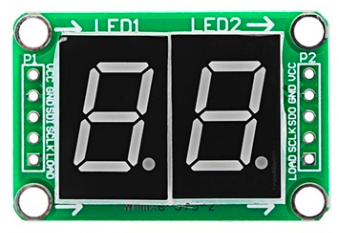

DIGO 7-Segment Display
======================

.. seo::
    :description: Instructions for setting up DIGO 7-Segment Display.
    :image: digo_led7seg.png

The ``digo_led7seg`` display platform allows you to use 2 digits Led 7 segment with 74HC595.

    DIGO LED 7-Segment.

.. code-block:: yaml

    # Example configuration entry
    display:
      - platform: digo_led7seg
        hc595_latch_pin: 26
        hc595_clock_pin: 27
        hc595_data_pin: 25
        digit_1_ctrl_pin: 18
        digit_2_ctrl_pin: 19
        lambda: |-
            it.setNumber((uint8_t)temperature);

Configuration variables:
------------------------

- **hc595_latch_pin** (**Required**, :ref:`Pin Schema <config-pin_schema>`): The pin you have the 74HC595 latch pin.
- **hc595_clock_pin** (**Required**, :ref:`Pin Schema <config-pin_schema>`): The pin you have the 74HC595 clock pin.
- **hc595_data_pin** (**Required**, :ref:`Pin Schema <config-pin_schema>`): The pin you have the 74HC595 data pin.
- **digit_1_ctrl_pin** (**Required**, :ref:`Pin Schema <config-pin_schema>`): The pin you have the digit 1 control pin.
- **digit_2_ctrl_pin** (**Required**, :ref:`Pin Schema <config-pin_schema>`): The pin you have the digit 2 control pine.
- **lambda** (*Optional*, :ref:`lambda <config-lambda>`): The lambda to use for rendering the number on the LED 7 Seg.
  See :ref:`display-led7seg_lambda` for more information.
- **update_interval** (*Optional*, :ref:`config-time`): The interval to re-draw the screen. Defaults to ``1s``.
- **id** (*Optional*, :ref:`config-id`): Manually specify the ID used for code generation.

.. _display-led7seg_lambda:

Rendering Lambda
----------------

.. code-block:: yaml

    display:
      - platform: digo_led7seg
        # ...
      lambda: |-
        lambda: |-
          it.setNumber((uint8_t)temperature);

Replace any number you want to display into ``temperature`` variable on above example.

Example code
^^^^^^^^^^^^

For example, if you want to read temperatrue value from ADC sensor and display, please refer below example code:

.. code-block:: yaml

    sensor:
    # Declare board temperature sensor
    - platform: ntc
        sensor: board_temperature_sensor
        calibration:
        b_constant: 3950
        reference_temperature: 25°C
        reference_resistance: 10kOhm
        name: Board Temperature

    # Configuration for board temperature sensor
    - platform: resistance
        internal: true
        id: board_temperature_sensor
        sensor: board_temperature_resistance_sensor
        configuration: DOWNSTREAM
        resistor: 33kOhm
        name: Board Temperature Resistance Sensor
    - platform: adc
        id: board_temperature_resistance_sensor
        pin: A5
        update_interval: 30s

    display:
    - platform: digo_led7seg
        hc595_latch_pin: 26
        hc595_clock_pin: 27
        hc595_data_pin: 25
        digit_1_ctrl_pin: 18
        digit_2_ctrl_pin: 19
        lambda: |-
          it.setNumber((uint8_t)id(water_temperature).get_state());

See Also
--------

- :doc:`index`
- :doc:`../../devices/digo/water_heater`
