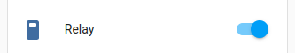

DIGO Switch
===========

.. seo::
    :description: Instructions for setting up a DIGO device switch.
    :image: pin.svg

The ``digo_relay`` switch platform creates a switch from a digo component
and requires `digo-component` to be configured.

.. code-block:: yaml

    # Example configuration entry
    switch:
      - platform: digo_relay
        name: "Relay"
        id: relay1
        relay_pin: 21
        zero_detect_pin: 35

Configuration variables:
------------------------

- **relay_pin** (**Required**, :ref:`Pin Schema <config-pin_schema>`): The GPIO pin to use for the switch.
- **zero_detect_pin** (**Required**, :ref:`Pin Schema <config-pin_schema>`): The GPIO pin to use for the zero detect.
- **name** (**Required**, string): The name for the switch.
- **id** (*Optional*, :ref:`config-id`): Manually specify the ID used for code generation.

- All other options from :ref:`Switch <config-switch>`.

See Also
--------

- :doc:`index`
- :doc:`/components/output/gpio`
- :doc:`/components/cover/template`
- :doc:`/cookbook/garage-door`
