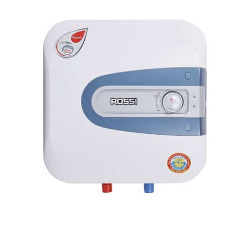

Digo Speaker Monitor
====================

.. seo::
    :description: Instructions for setting up a Digo Speaker Monitor.
    :image: water_heater.jpg

The ``digo_speaker_monitor`` overview introduction. `DongNX` would like to write somethings here ...
Use this component to integrate Digo Speaker Monitor into ESPHome / Home Assistant ecosystem.

    Water heater front and back view. Image by `DIGO <https://digotech.net/solution>`__.

The ``digo_speaker_monitor`` hardware introduction. Touch, Relay, Led7seg, ntc, ...

    Photo of something, images by `DIGO <https://digotech.net/solution>`__.

    Photo of serial port pins, images by `DIGO <https://digotech.net/solution>`__.

Before using this components make sure:

- board is configured to ``nodemcu-32s``
- :ref:`UART bus <uart>` is configured with default RX / TX pins and 115200 baud rate
- :doc:`logger </components/logger>` to the serial port is disabled by setting ``baud_rate`` to ``0``

This component is useless for devices other than Sonoff D1 dimmer.

.. code-block:: yaml

    # Example configuration entry
    esphome:
    name: waterheaterwifi

    # Need to include dogo custom components
    <<: !include digo_components.yaml

    # Make sure logging is not using the serial port
    logger:
      baud_rate: 0

    switch:
    - platform: digo_relay
        name: "Relay"
        id: relay1
        relay_pin: 21
        zero_detect_pin: 35
        on_turn_on:
        then:
            - rtttl.play: 'short:d=4,o=5,b=100:16e6'
        on_turn_off:
        then:
            - rtttl.play: 'short:d=4,o=5,b=100:16e6'

    sensor:
    - platform: wifi_signal # Reports the WiFi signal strength/RSSI in dB
        name: "WiFi Signal dB"
        id: wifi_signal_db
        update_interval: 30s
        entity_category: "diagnostic"

    - platform: copy # Reports the WiFi signal strength in %
        source_id: wifi_signal_db
        name: "WiFi Signal Percent"
        filters:
        - lambda: return min(max(2 * (x + 100.0), 0.0), 100.0);
        unit_of_measurement: " %"
        entity_category: "diagnostic"
        device_class: ""

    - platform: debug
        free:
        name: "Heap Free"

    # Declare water temperature sensor
    - platform: ntc
        sensor: water_temperature_sensor
        calibration:
        b_constant: 3950
        reference_temperature: 25°C
        reference_resistance: 10kOhm
        name: Water Temperature
        id: water_temperature
    # Declare board temperature sensor
    - platform: ntc
        sensor: board_temperature_sensor
        calibration:
        b_constant: 3950
        reference_temperature: 25°C
        reference_resistance: 10kOhm
        name: Board Temperature

    # Configuration for water temperature sensor
    - platform: resistance
        internal: true
        id: water_temperature_sensor
        sensor: water_temperature_resistance_sensor
        configuration: DOWNSTREAM
        resistor: 33kOhm
        name: Water Temperature Resistance Sensor
    - platform: adc
        id: water_temperature_resistance_sensor
        pin: A6
        update_interval: 30s
    # Configuration for board temperature sensor
    - platform: resistance
        internal: true
        id: board_temperature_sensor
        sensor: board_temperature_resistance_sensor
        configuration: DOWNSTREAM
        resistor: 33kOhm
        name: Board Temperature Resistance Sensor
    - platform: adc
        id: board_temperature_resistance_sensor
        pin: A5
        update_interval: 30s

    climate:
    - platform: bang_bang
        id: climate_1
        name: "Water Heater Controller"
        sensor: water_temperature
        default_target_temperature_low: 70 °C
        default_target_temperature_high: 75 °C

        visual:
        min_temperature: 20
        max_temperature: 100
        temperature_step: 1

        heat_action:
        - switch.turn_on: relay1
        idle_action:
        - switch.turn_off: relay1

Configuration variables:
------------------------

- **id** (*Optional*, :ref:`config-id`): Manually specify the ID used for code generation.
- **name** (**Required**, string): The name of the light.
- **use_rm433_remote** (*Optional*, boolean): Set to ``True`` if your setup uses Sonoff RM433
  or any other radio remote control. Properly setting this parameter allows the platform to
  identify what to do with incoming UART commands. RF chip is known to catch random commands
  if not paired with a real remote (so called ghost commands). This problem is observed even
  with the stock firmware and most probably is a bug in the MCU firmware or in the RF chip
  firmware. Setting this to ``False`` instructs the platform to properly ignore such commands
  and thus prevent unexpected switches or light intensity changes.
- **min_value** (*Optional*, int): The lowest dimmer value allowed. Acceptable value for your
  setup will depend on actual light bulbs installed and number of them. Start with the default
  value and check what will be the minimal brightness bulbs can render. Pay attention that for
  some dimmable LED lamps minimal turn-on brightness will be higher that the minimal achievable
  brightness if you just decrease it when lamp is already turned on. Defaults to 0.
- **max_value** (*Optional*, int): The highest dimmer value allowed. Use this to hard-limit light
  intensity for your setup. For some bulbs this parameter might be also useful to prevent
  flickering at high brightness values. Defaults to 100.
- All other options from :ref:`Light <config-light>`.

See Also
--------